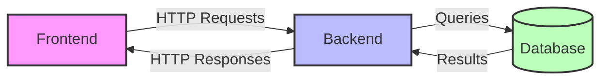
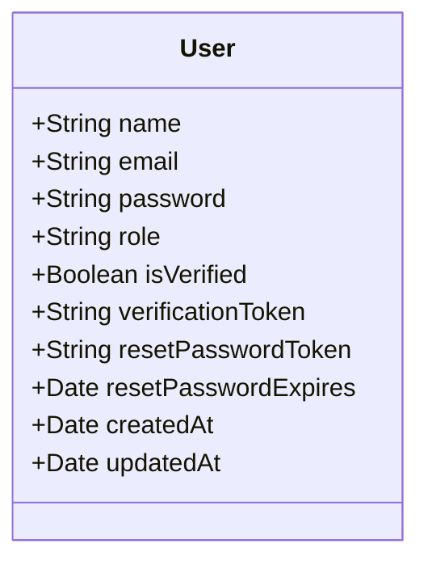
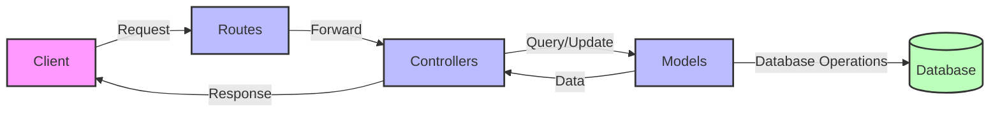
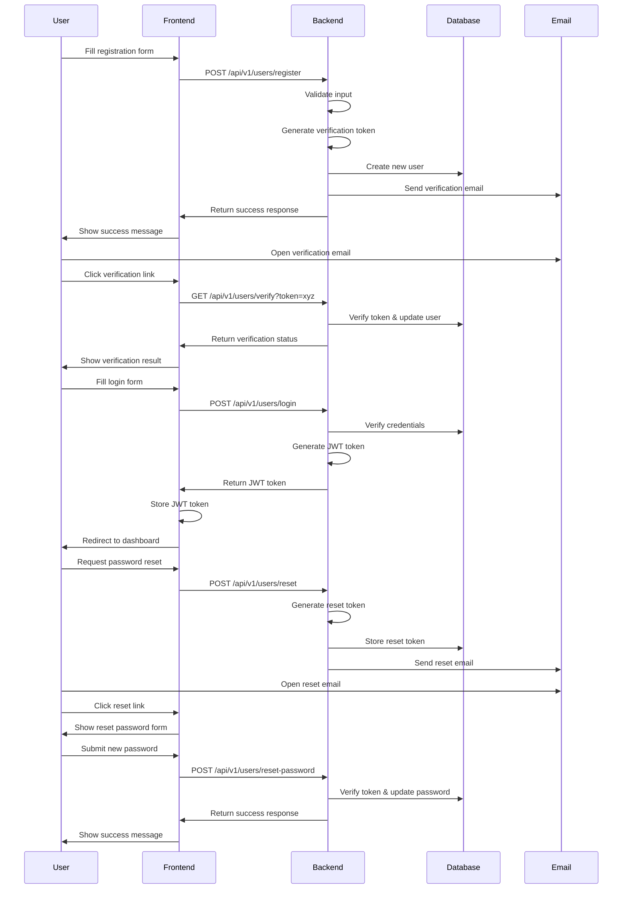
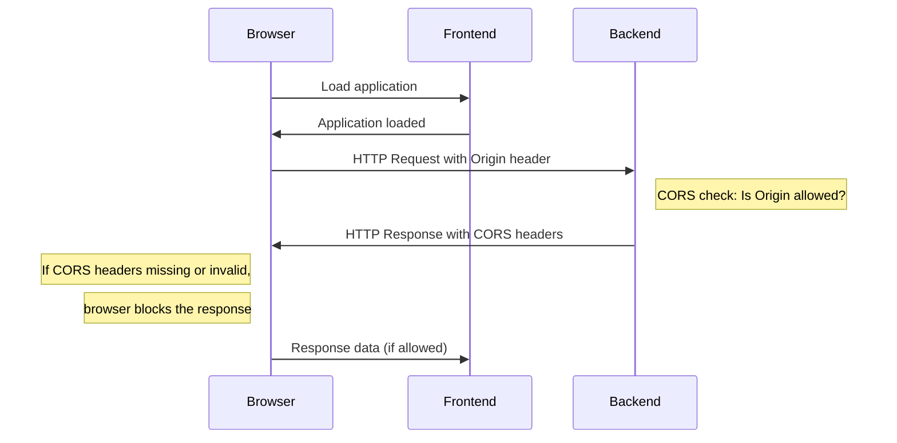
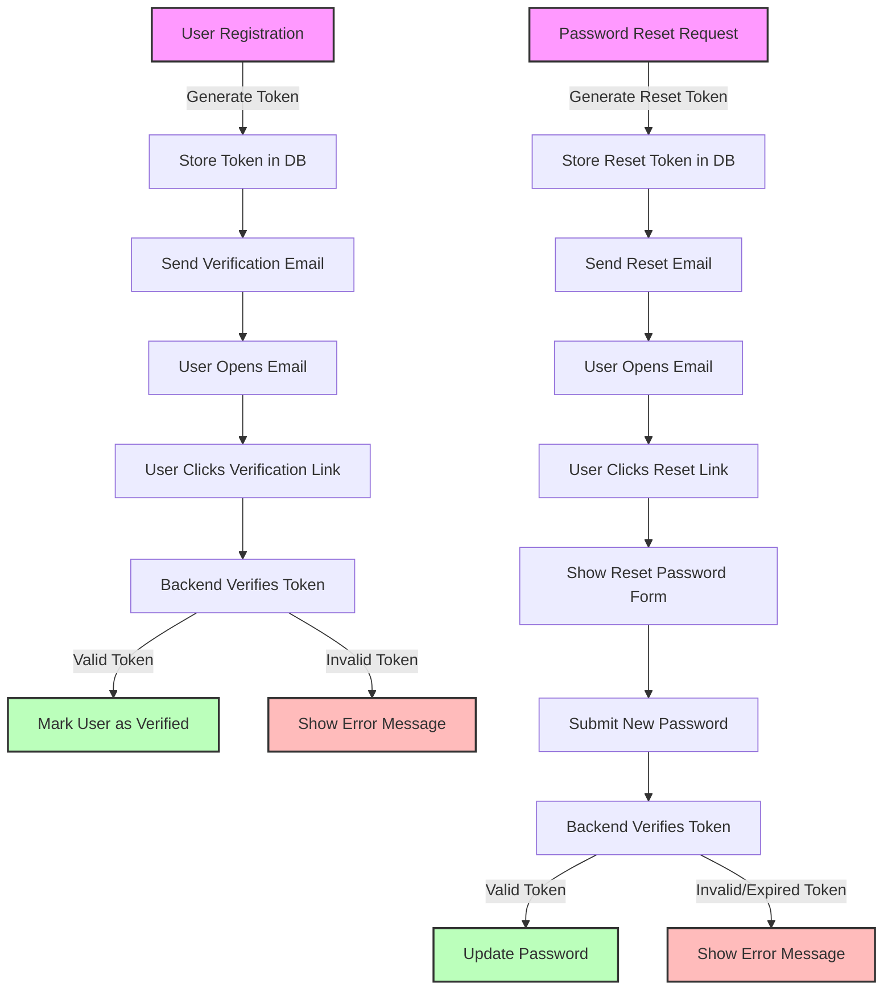
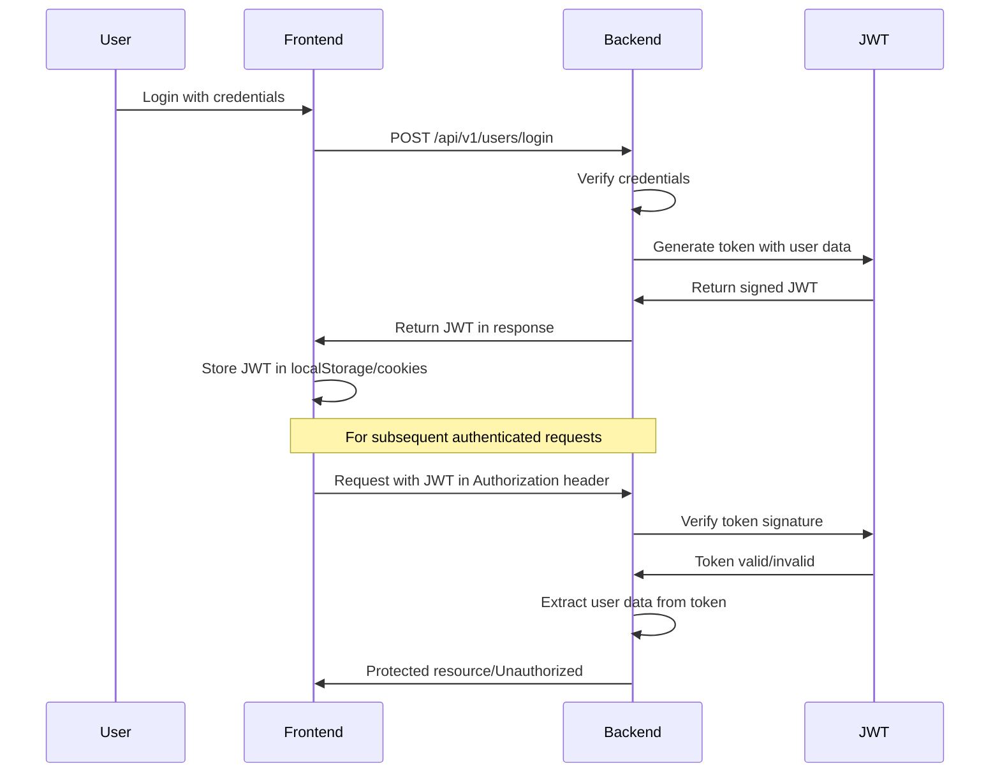
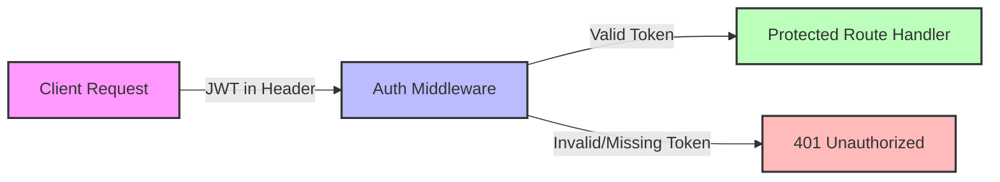
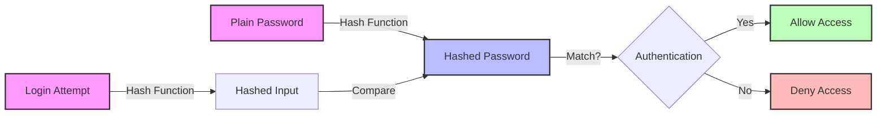

# Full Stack Authentication Project Guide

## Introduction

This guide will walk you through building a complete full-stack authentication system using Node.js, Express, MongoDB, and Mongoose. By the end of this tutorial, you'll have a working authentication system with user registration, login, and password reset functionality.

This project is perfect for beginners who want to understand how authentication works in web applications. We'll cover everything from setting up your development environment to implementing user verification flows.

## Project Overview



Our project consists of three main components:

1. **Frontend**: The client-side application that users interact with (React, Vue, etc.)
2. **Backend**: The server that processes requests and contains business logic (Node.js/Express)
3. **Database**: Where we store user information and other data (MongoDB)

The diagram above shows how these components interact with each other. The frontend sends HTTP requests to the backend, which processes them and communicates with the database. The backend then sends HTTP responses back to the frontend.

## File Structure

Here's the file structure we'll be creating:

```
Project/
├── controller/
│   └── user.controller.js
├── model/
│   └── User.model.js
├── routes/
│   └── user.routes.js
├── utils/
│   └── db.js
├── .env
├── index.js
├── package.json
└── package-lock.json
```

## Setting Up the Project

### Step 1: Initialize the Project

First, create a new directory for your project and navigate into it:

```bash
mkdir authentication-project
cd authentication-project
```

Initialize a new Node.js project:

```bash
npm init
```

You'll be prompted to enter some information about your project:
- Give it a semantic version (e.g., 1.0.0)
- Add a description (e.g., "A Node.js authentication project")
- Set the entry point to `index.js`
- You can choose whether to initialize git or not

### Step 2: Create the Basic File Structure

Create the necessary directories and files:

```bash
mkdir controller model routes utils
touch index.js .env
touch controller/user.controller.js
touch model/User.model.js
touch routes/user.routes.js
touch utils/db.js
```

### Step 3: Install Dependencies

Install the required packages:

```bash
npm install express mongoose cors dotenv bcrypt jsonwebtoken cookie-parser nodemailer crypto
npm install -D nodemon
```

- **express**: Web framework for Node.js
- **mongoose**: MongoDB object modeling tool
- **cors**: Middleware to enable Cross-Origin Resource Sharing
- **dotenv**: Loads environment variables from .env file
- **bcrypt**: Library for hashing passwords
- **jsonwebtoken**: Implementation of JSON Web Tokens
- **cookie-parser**: Middleware to parse cookies in requests
- **nodemailer**: Module for sending emails
- **crypto**: Node.js built-in module for cryptographic functionality
- **nodemon**: Development tool that automatically restarts the server when files change

### Step 4: Configure package.json

Open `package.json` and add the following:

```json
{
  "name": "authentication-project",
  "version": "1.0.0",
  "description": "A Node.js authentication project",
  "main": "index.js",
  "type": "module",
  "scripts": {
    "dev": "nodemon index.js"
  },
  "dependencies": {
    "cors": "^2.8.5",
    "dotenv": "^16.4.7",
    "express": "^4.21.2",
    "mongoose": "^8.12.1"
  },
  "devDependencies": {
    "nodemon": "^3.1.9"
  }
}
```

Note the `"type": "module"` line, which allows us to use ES6 import/export syntax instead of CommonJS require.

## Setting Up the Server

### Step 1: Create the .env File

Create a `.env` file in the root directory with the following content:

```
PORT=4000
MONGO_URL=mongodb+srv://<username>:<password>@<cluster-url>/<database-name>
BASE_URL=http://localhost:3000
```

Replace `<username>`, `<password>`, `<cluster-url>`, and `<database-name>` with your MongoDB Atlas credentials. You'll need to create a MongoDB Atlas account and set up a cluster if you don't have one already.

> **Important**: Never commit your .env file to version control systems like GitHub, as it contains sensitive information.

### Step 2: Set Up the Database Connection

Edit the `utils/db.js` file:

```javascript
import mongoose from "mongoose";
import dotenv from "dotenv";
dotenv.config();

// Function to connect to the database
const db = () => {
  mongoose
    .connect(process.env.MONGO_URL)
    .then(() => {
      console.log("Connected to MongoDB");
    })
    .catch((err) => {
      console.log("Error connecting to MongoDB", err);
    });
};

export default db;
```

### Step 3: Create the Main Server File

Edit the `index.js` file:

```javascript
import express from "express";
import dotenv from "dotenv";
import cors from "cors";
import cookieParser from "cookie-parser";
import db from "./utils/db.js";

// Import routes
import userRoutes from "./routes/user.routes.js";

// Load environment variables
dotenv.config();

// Initialize Express app
const app = express();

// Configure CORS
app.use(
  cors({
    origin: process.env.BASE_URL,
    credentials: true,
    methods: ["GET", "POST", "DELETE", "OPTIONS"],
    allowedHeaders: ["Content-Type", "Authorization"],
  })
);

// Middleware to parse JSON and URL-encoded data
app.use(express.json());
app.use(express.urlencoded({ extended: true }));
// Middleware to parse cookies
app.use(cookieParser());

// Set port from environment variables or use default
const port = process.env.PORT || 4000;

// Basic route
app.get("/", (req, res) => {
  res.send("Welcome to the Authentication API!");
});

// Connect to database
db();

// Use routes
app.use("/api/v1/users", userRoutes);

// Start the server
app.listen(port, () => {
  console.log(`Server running on port ${port}`);
});}
```

## Creating the User Model

### Step 1: Define the User Schema

Edit the `model/User.model.js` file:

```javascript
import mongoose from "mongoose";

const userSchema = new mongoose.Schema(
  {
    name: String,
    email: String,
    password: String,
    role: {
      type: String,
      enum: ["user", "admin"],
      default: "user",
    },
    isVerified: {
      type: Boolean,
      default: false,
    },
    verificationToken: {
      type: String,
    },
    resetPasswordToken: {
      type: String,
    },
    resetPasswordExpires: {
      type: Date,
    },
  },
  {
    timestamps: true,
  }
);

const User = mongoose.model("User", userSchema);

export default User;
```



The User Schema includes:
- **name**: User's full name
- **email**: User's email address
- **password**: User's password (should be hashed before storing)
- **role**: User's role (user or admin)
- **isVerified**: Whether the user's email is verified
- **verificationToken**: Token for email verification
- **resetPasswordToken**: Token for password reset
- **resetPasswordExpires**: Expiration time for password reset token
- **timestamps**: Automatically adds createdAt and updatedAt fields

Each field serves a specific purpose in our authentication system:
- The **password** field should never store plain text passwords. We'll use bcrypt to hash passwords before storing them.
- The **role** field allows for basic role-based access control in our application.
- The **isVerified** flag ensures users verify their email before gaining full access.
- The **verificationToken** is used in the email verification process.
- The **resetPasswordToken** and **resetPasswordExpires** fields are used for the password reset functionality.

## Understanding the MVC Architecture



Our authentication system follows the MVC (Model-View-Controller) architecture pattern:

1. **Models**: Define the data structure and handle database operations
   - In our case, the User model defines the schema for user data
   - Models interact directly with the database using Mongoose

2. **Views**: In a full-stack application, this is typically the frontend
   - Our backend doesn't handle views directly
   - Instead, it sends JSON responses that the frontend renders

3. **Controllers**: Contain the business logic of the application
   - Controllers receive requests from routes
   - They process the data, interact with models, and send responses
   - Each controller function handles a specific operation (register, login, etc.)

4. **Routes**: Define the API endpoints and connect them to controllers
   - Routes specify the URL paths and HTTP methods
   - They direct incoming requests to the appropriate controller functions

## Setting Up Routes and Controllers

### Step 1: Create the User Controller

Edit the `controller/user.controller.js` file:

```javascript
import User from "../model/User.model.js";

// Register a new user
const registerUser = async (req, res) => {
  try {
    // Extract user data from request body
    const { name, email, password } = req.body;
    
    // Validate input (basic validation)
    if (!name || !email || !password) {
      return res.status(400).json({ message: "All fields are required" });
    }
    
    // Check if user already exists
    const existingUser = await User.findOne({ email });
    if (existingUser) {
      return res.status(400).json({ message: "User already exists" });
    }
    
    // Generate verification token (in a real app, use a secure random generator)
    const verificationToken = Math.random().toString(36).substring(2, 15);
    
    // Create new user
    const newUser = new User({
      name,
      email,
      password, // In a real app, hash this password before storing
      verificationToken
    });
    
    // Save user to database
    await newUser.save();
    
    // In a real app, send verification email here
    
    // Return success response
    res.status(201).json({ 
      message: "User registered successfully", 
      user: { id: newUser._id, name, email } 
    });
  } catch (error) {
    res.status(500).json({ message: "Error registering user", error: error.message });
  }
};

// Login user
const loginUser = async (req, res) => {
  try {
    // Extract login credentials
    const { email, password } = req.body;
    
    // Validate input
    if (!email || !password) {
      return res.status(400).json({ message: "Email and password are required" });
    }
    
    // Find user by email
    const user = await User.findOne({ email });
    if (!user) {
      return res.status(401).json({ message: "Invalid credentials" });
    }
    
    // Check password (in a real app, compare hashed passwords)
    if (user.password !== password) {
      return res.status(401).json({ message: "Invalid credentials" });
    }
    
    // Check if user is verified
    if (!user.isVerified) {
      return res.status(401).json({ message: "Please verify your email first" });
    }
    
    // In a real app, generate and return JWT token here
    
    // Return success response
    res.status(200).json({ 
      message: "Login successful",
      user: { id: user._id, name: user.name, email: user.email }
    });
  } catch (error) {
    res.status(500).json({ message: "Error logging in", error: error.message });
  }
};

export { registerUser, loginUser };
```

### Step 2: Set Up the User Routes

Edit the `routes/user.routes.js` file:

```javascript
import express from "express";
import { registerUser, loginUser, verifyUser, requestPasswordReset, resetPassword } from "../controller/user.controller.js";

const router = express.Router();

// Register route
router.post("/register", registerUser);

// Login route
router.post("/login", loginUser);

// Email verification route
router.get("/verify", verifyUser);

// Password reset request route
router.post("/reset", requestPasswordReset);

// Reset password with token route
router.post("/reset-password", resetPassword);

export default router;
```

### Controller Functions Explained

Each controller function follows a similar pattern:

1. **Extract data** from the request (usually from `req.body`, `req.params`, or `req.query`)
2. **Validate the input** to ensure all required fields are present and valid
3. **Perform business logic** (database operations, token generation, etc.)
4. **Send an appropriate response** with status code and JSON data
5. **Handle errors** using try/catch blocks

This separation of concerns makes the code more maintainable and easier to test.

## Understanding the Authentication Flow



The authentication flow in our application works as follows:

1. **User Registration**:
   - User submits registration form with name, email, and password
   - Backend validates the input (checks for valid email format, password strength, etc.)
   - Backend creates a new user in the database with a verification token
   - Backend sends a verification email to the user with a link containing the token
   - User receives a success message indicating they need to verify their email

2. **Email Verification**:
   - User receives an email with a verification link
   - User clicks the verification link which directs them to the frontend application
   - Frontend extracts the token from the URL and sends it to the backend
   - Backend verifies the token and marks the user as verified in the database
   - User is notified that their account is now verified and they can log in

3. **User Login**:
   - User submits login form with email and password
   - Backend validates the credentials against the database
   - Backend checks if the user is verified
   - Backend generates a JWT (JSON Web Token) containing user information and sends it to the frontend
   - Frontend stores the token in localStorage or cookies for subsequent authenticated requests
   - User is redirected to the dashboard or home page

4. **Password Reset**:
   - User requests a password reset by providing their email
   - Backend generates a reset token with an expiration time and stores it in the database
   - Backend sends a reset email with a link containing the token
   - User clicks the reset link and is directed to a password reset form
   - User submits a new password
   - Backend verifies the token, checks if it's not expired, and updates the password
   - User is notified that their password has been updated successfully

This flow ensures secure user authentication while providing a good user experience with features like email verification and password reset.

## Understanding CORS



CORS (Cross-Origin Resource Sharing) is a security feature implemented by browsers that restricts web pages from making requests to a different domain than the one that served the web page.

Here's how CORS works:

1. When a browser makes a cross-origin request, it automatically adds an `Origin` header indicating where the request originated from
2. The server checks if the origin is allowed to access its resources
3. The server includes CORS headers in the response to indicate which origins, methods, and headers are permitted
4. If the server doesn't include appropriate CORS headers, the browser blocks the response from reaching the frontend application

In our application, the frontend and backend may be running on different ports or domains. For example, the frontend might be on `http://localhost:3000` while the backend is on `http://localhost:4000`. Without CORS, the browser would block requests from the frontend to the backend.

We configure CORS in our backend to allow requests from our frontend:

```javascript
app.use(
  cors({
    origin: process.env.BASE_URL, // The frontend URL
    credentials: true, // Allow cookies to be sent
    methods: ["GET", "POST", "DELETE", "OPTIONS"], // Allowed HTTP methods
    allowedHeaders: ["Content-Type", "Authorization"], // Allowed headers
  })
);
```

This configuration:
- Allows requests only from the origin specified in `BASE_URL` environment variable
- Enables credentials (cookies, HTTP authentication) to be sent with cross-origin requests
- Restricts the HTTP methods that can be used
- Specifies which headers can be included in requests

## Understanding API Routes and HTTP Verbs

```mermaid
flowchart TD
    A[API Routes]
    B[GET - Retrieve Data]
    C[POST - Create Data]
    D[PUT - Update Data]
    E[DELETE - Remove Data]
    F[/api/v1/users/register]
    G[/api/v1/users/verify]
    H[/api/v1/users/login]
    I[/api/v1/users/reset]
    J[/api/v1/users/reset-password]
    
    A --> B
    A --> C
    A --> D
    A --> E
    
    C --> F
    B --> G
    C --> H
    C --> I
    C --> J
    
    style A fill:#f9f,stroke:#333,stroke-width:2px
    style B fill:#bbf,stroke:#333,stroke-width:2px
    style C fill:#bbf,stroke:#333,stroke-width:2px
    style D fill:#bbf,stroke:#333,stroke-width:2px
    style E fill:#bbf,stroke:#333,stroke-width:2px
```

Our API uses RESTful principles with standard HTTP verbs:

- **GET**: Retrieve data (read operations)
  - Example: Getting user profile information
  - Safe and idempotent (multiple identical requests have the same effect as a single request)

- **POST**: Create new data (create operations)
  - Example: Creating a new user account
  - Not idempotent (multiple identical requests may create multiple resources)

- **PUT**: Update existing data (update operations)
  - Example: Updating user profile information
  - Idempotent (multiple identical requests have the same effect as a single request)

- **DELETE**: Remove data (delete operations)
  - Example: Deleting a user account
  - Idempotent (multiple identical requests have the same effect as a single request)

For example, our user registration endpoint uses POST because we're creating a new user:

```javascript
router.post("/register", registerUser);
```

The full URL for this endpoint would be `http://localhost:4000/api/v1/users/register`.

In our MVC architecture:
1. The **routes** define the endpoints and HTTP methods
2. The **controllers** contain the business logic for each endpoint
3. The **models** define the data structure and interact with the database

## User Verification Flow



The user verification flow works as follows:

### Email Verification Process
1. When a user registers, we generate a unique verification token using a secure random string generator
2. We store this token in the user's document in the database along with their other information
3. We send an email to the user with a verification link containing the token (e.g., `http://localhost:3000/verify?token=abc123`)
4. When the user clicks the link, they're directed to our frontend application
5. The frontend extracts the token from the URL and sends it to the backend verification endpoint
6. The backend looks up the user with this verification token
7. If found, the backend updates the user's `isVerified` status to `true` and clears the verification token
8. The user is now verified and can access protected features of the application

### Password Reset Process
1. User requests a password reset by providing their email address
2. Backend generates a secure random reset token and sets an expiration time (typically 1 hour)
3. Backend stores the token and expiration time in the user's document
4. Backend sends an email with a reset link containing the token
5. User clicks the link and is directed to a password reset form
6. User submits a new password
7. Backend verifies the token exists, belongs to the user, and hasn't expired
8. If valid, backend updates the user's password (after hashing) and clears the reset token

### API Endpoints for These Flows
- `POST /api/v1/users/register`: Register a new user and generate verification token
- `GET /api/v1/users/verify?token=xyz`: Verify a user's email with a verification token
- `POST /api/v1/users/reset`: Request a password reset (requires email in request body)
- `POST /api/v1/users/reset-password`: Set a new password with a reset token

Implementing these flows ensures that user emails are verified and provides a secure way for users to reset forgotten passwords.

## Running the Application

To start the application, run:

```bash
npm run dev
```

This will start the server using nodemon, which will automatically restart the server when you make changes to the code.

## Implementing JWT Authentication



### What is JWT?

JSON Web Token (JWT) is an open standard (RFC 7519) that defines a compact and self-contained way for securely transmitting information between parties as a JSON object. JWTs are commonly used for authentication and authorization in web applications.

A JWT consists of three parts:
1. **Header**: Contains the token type and signing algorithm
2. **Payload**: Contains claims (user data and metadata)
3. **Signature**: Ensures the token hasn't been altered

### Implementing JWT in Our Application

To implement JWT authentication, we need to:

1. Install the required package:
```bash
npm install jsonwebtoken
```

2. Create a JWT utility function in `utils/jwt.js`:
```javascript
import jwt from 'jsonwebtoken';
import dotenv from 'dotenv';
dotenv.config();

// Secret key for signing JWTs (should be in .env file)
const JWT_SECRET = process.env.JWT_SECRET || 'your-secret-key';

// Generate JWT token
export const generateToken = (user) => {
  return jwt.sign(
    { id: user._id, email: user.email, role: user.role },
    JWT_SECRET,
    { expiresIn: '1d' } // Token expires in 1 day
  );
};

// Verify JWT token
export const verifyToken = (token) => {
  try {
    return jwt.verify(token, JWT_SECRET);
  } catch (error) {
    return null;
  }
};
```

3. Update the login controller to generate and return a JWT:
```javascript
import { generateToken } from '../utils/jwt.js';

const loginUser = async (req, res) => {
  try {
    // ... existing login logic ...
    
    // Generate JWT token
    const token = generateToken(user);
    
    // Return token with user data
    res.status(200).json({ 
      message: "Login successful",
      token,
      user: { id: user._id, name: user.name, email: user.email }
    });
  } catch (error) {
    res.status(500).json({ message: "Error logging in", error: error.message });
  }
};
```

## Creating Authentication Middleware



Middleware functions in Express are functions that have access to the request object (`req`), the response object (`res`), and the next middleware function in the application's request-response cycle.

We'll create an authentication middleware to protect routes that require authentication:

1. Create a middleware directory and file:
```bash
mkdir middleware
touch middleware/auth.middleware.js
```

2. Implement the authentication middleware:
```javascript
import { verifyToken } from '../utils/jwt.js';

export const authenticate = (req, res, next) => {
  try {
    // Get token from Authorization header
    const authHeader = req.headers.authorization;
    
    if (!authHeader || !authHeader.startsWith('Bearer ')) {
      return res.status(401).json({ message: 'Authentication required' });
    }
    
    // Extract token from header
    const token = authHeader.split(' ')[1];
    
    // Verify token
    const decoded = verifyToken(token);
    if (!decoded) {
      return res.status(401).json({ message: 'Invalid or expired token' });
    }
    
    // Add user data to request object
    req.user = decoded;
    
    // Proceed to the protected route
    next();
  } catch (error) {
    res.status(401).json({ message: 'Authentication failed', error: error.message });
  }
};

// Optional: Role-based authorization middleware
export const authorize = (roles = []) => {
  return (req, res, next) => {
    if (!req.user) {
      return res.status(401).json({ message: 'Authentication required' });
    }
    
    if (roles.length && !roles.includes(req.user.role)) {
      return res.status(403).json({ message: 'Forbidden: Insufficient permissions' });
    }
    
    next();
  };
};
```

3. Use the middleware to protect routes:
```javascript
import { authenticate, authorize } from '../middleware/auth.middleware.js';

// Public routes
router.post("/register", registerUser);
router.post("/login", loginUser);
router.get("/verify", verifyUser);
router.post("/reset", requestPasswordReset);
router.post("/reset-password", resetPassword);

// Protected routes
router.get("/profile", authenticate, getUserProfile);
router.put("/profile", authenticate, updateUserProfile);

// Admin-only routes
router.get("/users", authenticate, authorize(['admin']), getAllUsers);
```

## Implementing Email Verification

### Setting Up Nodemailer with Mailtrap

Email verification is an important security feature that ensures users provide valid email addresses. We'll use Nodemailer with Mailtrap for testing our email functionality.

1. Install the required packages:
```bash
npm install nodemailer crypto cookie-parser
```

2. Create a utility file for email functionality in `utils/email.js`:
```javascript
import nodemailer from 'nodemailer';
import dotenv from 'dotenv';
dotenv.config();

const sendEmail = async (options) => {
  // Create a transporter using Mailtrap
  const transporter = nodemailer.createTransport({
    host: process.env.EMAIL_HOST || 'smtp.mailtrap.io',
    port: process.env.EMAIL_PORT || 2525,
    auth: {
      user: process.env.EMAIL_USERNAME,
      pass: process.env.EMAIL_PASSWORD
    }
  });

  // Define email options
  const mailOptions = {
    from: process.env.EMAIL_FROM || 'noreply@auth-app.com',
    to: options.email,
    subject: options.subject,
    text: options.message,
    html: options.html
  };

  // Send the email
  await transporter.sendMail(mailOptions);
};

export default sendEmail;
```

3. Update the `.env` file to include Mailtrap credentials:
```
EMAIL_HOST=smtp.mailtrap.io
EMAIL_PORT=2525
EMAIL_USERNAME=your_mailtrap_username
EMAIL_PASSWORD=your_mailtrap_password
EMAIL_FROM=noreply@auth-app.com
JWT_SECRET=your_jwt_secret
```

### Implementing Verification Token Generation

We'll use the crypto module to generate secure random tokens for email verification:

1. Update the user controller to include verification functionality:
```javascript
import crypto from 'crypto';
import User from '../model/User.model.js';
import sendEmail from '../utils/email.js';

// Register a new user with verification
const registerUser = async (req, res) => {
  try {
    const { name, email, password } = req.body;
    
    // Validate input
    if (!name || !email || !password) {
      return res.status(400).json({ message: "All fields are required" });
    }
    
    // Check if user already exists
    const existingUser = await User.findOne({ email });
    if (existingUser) {
      return res.status(400).json({ message: "User already exists" });
    }
    
    // Generate verification token using crypto
    const verificationToken = crypto.randomBytes(32).toString('hex');
    
    // Create new user
    const newUser = new User({
      name,
      email,
      password,
      verificationToken
    });
    
    // Save user to database
    await newUser.save();
    
    // Create verification URL
    const verificationURL = `${process.env.BASE_URL}/verify?token=${verificationToken}`;
    
    // Send verification email
    await sendEmail({
      email: newUser.email,
      subject: 'Please verify your email',
      message: `Please click on the link to verify your email: ${verificationURL}`,
      html: `<p>Please click <a href="${verificationURL}">here</a> to verify your email.</p>`
    });
    
    // Return success response (without sending the verification token)
    res.status(201).json({ 
      message: "User registered successfully. Please check your email to verify your account.", 
      user: { id: newUser._id, name, email } 
    });
  } catch (error) {
    res.status(500).json({ message: "Error registering user", error: error.message });
  }
};

// Verify user email
const verifyUser = async (req, res) => {
  try {
    const { token } = req.query;
    
    // Find user with the verification token
    const user = await User.findOne({ verificationToken: token });
    
    if (!user) {
      return res.status(400).json({ message: "Invalid or expired verification token" });
    }
    
    // Update user verification status
    user.isVerified = true;
    user.verificationToken = null; // Remove the verification token
    await user.save();
    
    res.status(200).json({ message: "Email verified successfully. You can now log in." });
  } catch (error) {
    res.status(500).json({ message: "Error verifying email", error: error.message });
  }
};
```

## Implementing Password Reset

Password reset functionality allows users to regain access to their accounts if they forget their passwords.

1. Add password reset request controller:
```javascript
const requestPasswordReset = async (req, res) => {
  try {
    const { email } = req.body;
    
    // Find user by email
    const user = await User.findOne({ email });
    if (!user) {
      return res.status(404).json({ message: "User not found" });
    }
    
    // Generate reset token
    const resetToken = crypto.randomBytes(32).toString('hex');
    
    // Hash the reset token and save to user
    user.resetPasswordToken = crypto
      .createHash('sha256')
      .update(resetToken)
      .digest('hex');
      
    // Set token expiration (1 hour)
    user.resetPasswordExpires = Date.now() + 60 * 60 * 1000;
    
    await user.save();
    
    // Create reset URL
    const resetURL = `${process.env.BASE_URL}/reset-password?token=${resetToken}`;
    
    // Send reset email
    await sendEmail({
      email: user.email,
      subject: 'Password Reset Request',
      message: `Please click on the link to reset your password: ${resetURL}. The link is valid for 1 hour.`,
      html: `<p>Please click <a href="${resetURL}">here</a> to reset your password. The link is valid for 1 hour.</p>`
    });
    
    res.status(200).json({ message: "Password reset link sent to your email" });
  } catch (error) {
    res.status(500).json({ message: "Error requesting password reset", error: error.message });
  }
};

// Reset password with token
const resetPassword = async (req, res) => {
  try {
    const { token, password } = req.body;
    
    if (!token || !password) {
      return res.status(400).json({ message: "Token and password are required" });
    }
    
    // Hash the token from the request to compare with stored hash
    const hashedToken = crypto
      .createHash('sha256')
      .update(token)
      .digest('hex');
    
    // Find user with the reset token and check if it's not expired
    const user = await User.findOne({
      resetPasswordToken: hashedToken,
      resetPasswordExpires: { $gt: Date.now() }
    });
    
    if (!user) {
      return res.status(400).json({ message: "Invalid or expired reset token" });
    }
    
    // Update password and clear reset token fields
    user.password = password; // Will be hashed by the pre-save hook
    user.resetPasswordToken = null;
    user.resetPasswordExpires = null;
    
    await user.save();
    
    res.status(200).json({ message: "Password reset successful. You can now log in with your new password." });
  } catch (error) {
    res.status(500).json({ message: "Error resetting password", error: error.message });
  }
};
```

## Next Steps

This guide has covered the implementation of a complete authentication system including:

1. **User Registration with Email Verification**: Using Nodemailer and crypto for secure token generation
2. **Password Security**: Using bcrypt.js to hash passwords before storing them
3. **JWT Authentication**: Generating and verifying JWT tokens for authenticated requests
4. **Password Reset Flow**: Allowing users to securely reset forgotten passwords
5. **Security Best Practices**: Using HTTP-only cookies, CSRF protection, and proper error handling

To make this system production-ready, consider:

1. **Adding Input Validation**: Use a library like Joi or express-validator
2. **Implementing Rate Limiting**: Prevent brute force attacks
3. **Adding Frontend**: Create a frontend application that interacts with your API
4. **Adding Testing**: Write unit and integration tests for your authentication system


## Implementing Password Security



### Password Hashing

Storing plain text passwords is a major security risk. Instead, we should hash passwords before storing them in the database. Hashing is a one-way function that converts a password into a fixed-length string of characters.

1. Install bcrypt:
```bash
npm install bcrypt
```

2. Update the User model to hash passwords before saving:
```javascript
import mongoose from "mongoose";
import bcrypt from "bcrypt";

const userSchema = new mongoose.Schema(
  {
    name: String,
    email: String,
    password: String,
    // ... other fields
  },
  {
    timestamps: true,
  }
);

// Hash password before saving
// We don't use arrow functions here because we need access to 'this'
userSchema.pre("save", async function (next) {
  // Only hash the password if it's modified (or new)
  if (!this.isModified("password")) return next();
  
  try {
    // Hash the password with a salt factor of 10
    this.password = await bcrypt.hash(this.password, 10);
    next();
  } catch (error) {
    next(error);
  }
});

// Method to compare passwords
userSchema.methods.comparePassword = async function (candidatePassword) {
  return await bcrypt.compare(candidatePassword, this.password);
};

const User = mongoose.model("User", userSchema);

export default User;
```

3. Update the login controller to use the comparePassword method:
```javascript
const loginUser = async (req, res) => {
  try {
    const { email, password } = req.body;
    
    // Find user by email
    const user = await User.findOne({ email });
    if (!user) {
      return res.status(401).json({ message: "Invalid email or password" });
    }
    
    // Compare passwords using the method we defined
    const isMatch = await user.comparePassword(password);
    if (!isMatch) {
      return res.status(401).json({ message: "Invalid email or password" });
    }
    
    // Generate JWT token
    const token = jwt.sign(
      { id: user._id, role: user.role },
      process.env.JWT_SECRET || "shhh",
      { expiresIn: '24h' }
    );
    
    // Set cookie options
    const cookieOptions = {
      expires: new Date(Date.now() + 24 * 60 * 60 * 1000), // 24 hours
      httpOnly: true, // Cannot be accessed by client-side JavaScript
      secure: process.env.NODE_ENV === "production", // Only sent over HTTPS in production
      sameSite: "strict" // Protection against CSRF attacks
    };
    
    // Set cookie and send response
    res.cookie("token", token, cookieOptions);
    
    res.status(200).json({ 
      message: "Login successful",
      user: { id: user._id, name: user.name, email: user.email, role: user.role }
    });
  } catch (error) {
    res.status(500).json({ message: "Error logging in", error: error.message });
  }
};
```
```

### Security Best Practices

1. **Use HTTPS**: Always use HTTPS in production to encrypt data in transit.

2. **Rate Limiting**: Implement rate limiting to prevent brute force attacks:
```bash
npm install express-rate-limit
```

```javascript
import rateLimit from 'express-rate-limit';

// Apply rate limiting to login attempts
const loginLimiter = rateLimit({
  windowMs: 15 * 60 * 1000, // 15 minutes
  max: 5, // 5 attempts per window
  message: { message: 'Too many login attempts, please try again later' }
});

// Apply to login route
router.post("/login", loginLimiter, loginUser);
```

3. **Secure Headers**: Use helmet to set secure HTTP headers:
```bash
npm install helmet
```

```javascript
import helmet from 'helmet';

// Add helmet to your Express app
app.use(helmet());
```

4. **Input Validation**: Use a library like Joi or express-validator to validate user input:
```bash
npm install joi
```

```javascript
import Joi from 'joi';

// Validation schema for registration
const registerSchema = Joi.object({
  name: Joi.string().required(),
  email: Joi.string().email().required(),
  password: Joi.string().min(8).required()
});

// Middleware for validation
const validateRegistration = (req, res, next) => {
  const { error } = registerSchema.validate(req.body);
  if (error) {
    return res.status(400).json({ message: error.details[0].message });
  }
  next();
};

// Apply to register route
router.post("/register", validateRegistration, registerUser);
```

5. **Environment Variables**: Store sensitive information like database credentials and JWT secrets in environment variables.

## Conclusion

You've now set up the foundation for a full-stack authentication system. This project demonstrates the key concepts of user authentication, including registration, verification, login, and password reset.

By implementing proper security measures like password hashing, JWT authentication, and input validation, you've created a secure system that follows industry best practices.

This knowledge will help you build more complex applications that require robust user authentication and authorization systems.

## Glossary

- **API (Application Programming Interface)**: A set of rules that allows different software applications to communicate with each other
- **CORS (Cross-Origin Resource Sharing)**: A security feature that restricts web pages from making requests to a different domain
- **JWT (JSON Web Token)**: A compact, URL-safe means of representing claims to be transferred between two parties
- **Middleware**: Functions that have access to the request and response objects in an Express application
- **MongoDB**: A NoSQL database that stores data in flexible, JSON-like documents
- **Mongoose**: An Object Data Modeling (ODM) library for MongoDB and Node.js
- **REST (Representational State Transfer)**: An architectural style for designing networked applications
- **Schema**: A blueprint for how data should be structured in a database
- **Bcrypt**: A password-hashing function designed to securely hash passwords
- **Salt**: Random data added to a password before hashing to prevent rainbow table attacks
- **Rate Limiting**: A technique to limit the number of requests a user can make in a given time period