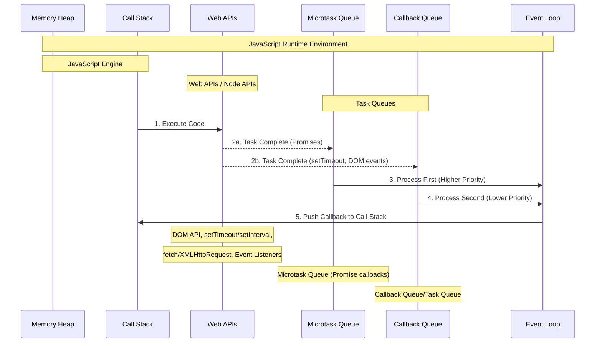
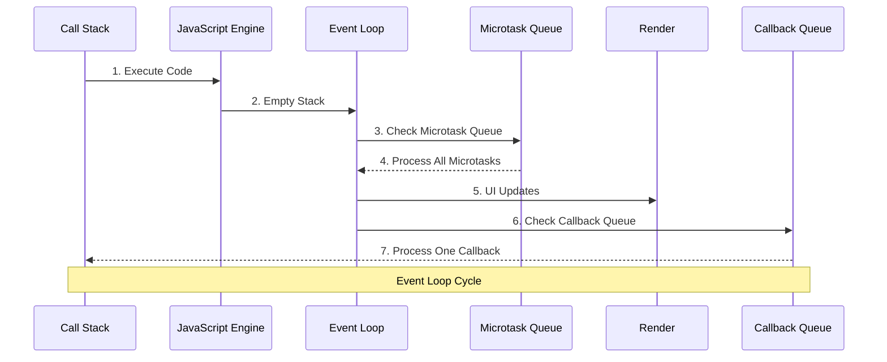
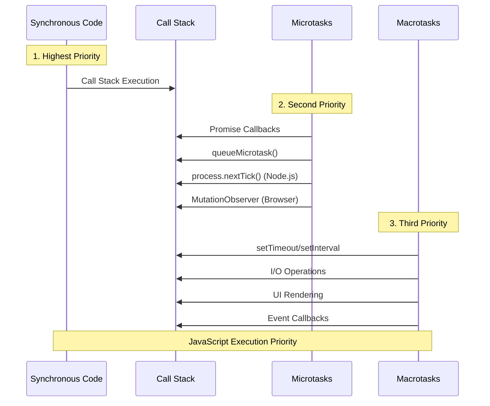
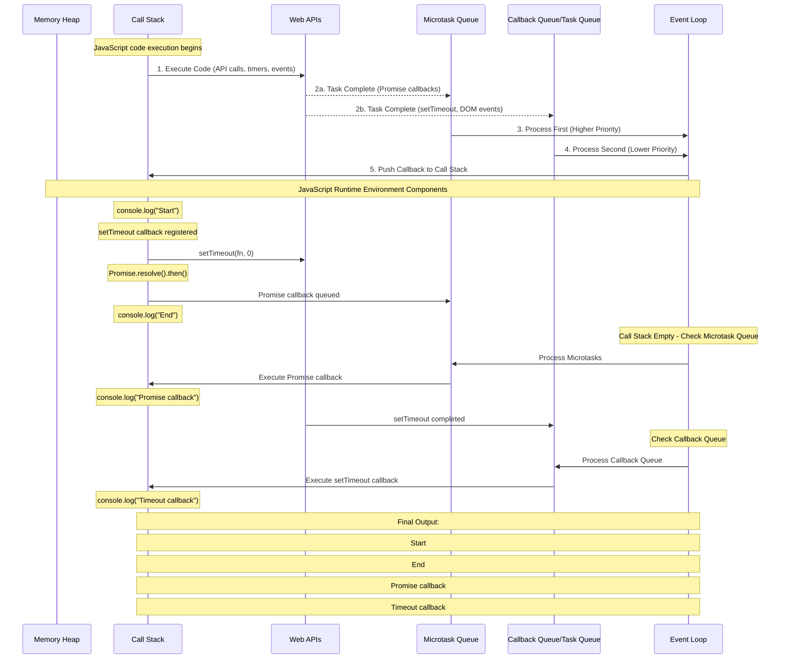
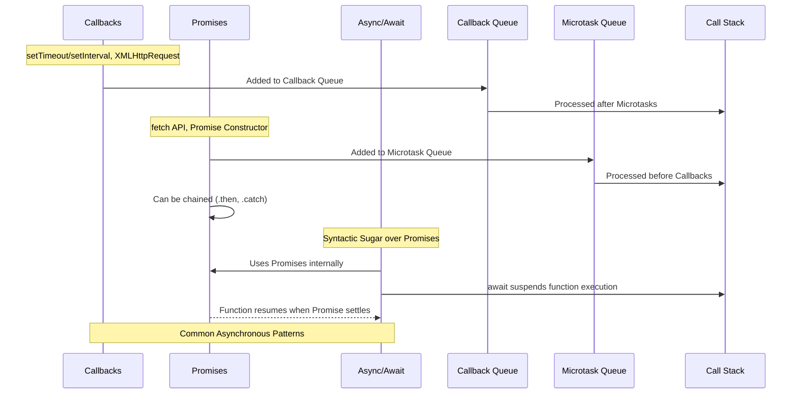

# JavaScript Execution Model Flowcharts

## Table of Contents

1. [JavaScript Runtime Environment](#javascript-runtime-environment)
2. [Event Loop Overview](#event-loop-overview)
3. [Execution Priority](#execution-priority)
4. [Asynchronous Operations Flow](#asynchronous-operations-flow)
5. [Common Asynchronous Patterns](#common-asynchronous-patterns)

## JavaScript Runtime Environment

This diagram shows the main components of the JavaScript runtime environment and how they interact with each other.

## Event Loop Overview

The event loop is the mechanism that allows JavaScript to perform non-blocking operations despite being single-threaded.

## Execution Priority

This diagram illustrates the priority order in which JavaScript executes different types of code.

## Asynchronous Operations Flow

This diagram shows how asynchronous operations flow through the JavaScript runtime.

## Common Asynchronous Patterns

This diagram illustrates common asynchronous patterns in JavaScript and how they interact with the event loop.

