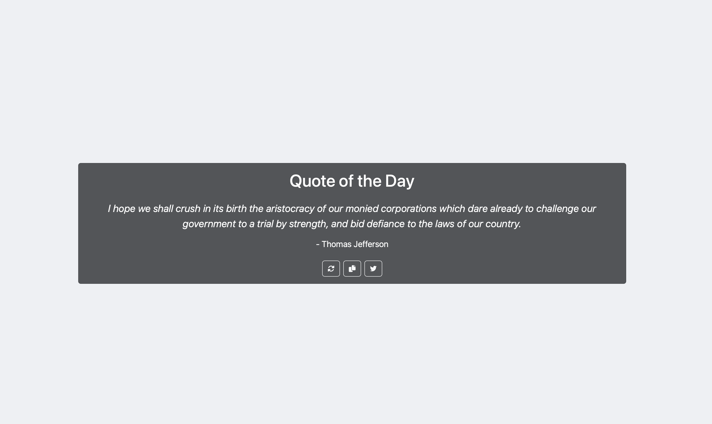

# Quote of the Day Application

A simple and elegant web application that displays random quotes fetched from an API. Users can get new quotes, copy them to clipboard and even share them on Twitter.

## Features

- 🎯 Fetch and display random quotes from API
- 📋 Copy quotes to clipboard
- 🐦 Share quotes on Twitter
- 📱 Fully responsive design

## Tech Stack

- HTML5
- CSS3
- Bootstrap5
- JavaScript
- [Free Quotes API](https://freeapi.app)

## Getting Started

1. Clone the repository
2. Open index.html in your browser
- this is a static website, so we dont need a server

## API Reference

This project uses the Free Quotes API to fetch random quotes:
- Endpoint: `https://api.freeapi.app/api/v1/public/quotes/quote/random`
- Documentation: [API Guide](https://freeapi.hashnode.space/api-guide/apireference/getARandomQuote)

## Deployment
- You can view the deployed version of the application [here](https://quote-of-the-day-manya.netlify.app/)

## Screenshots

*Screenshots of the deployed website*

## Contributing

Feel free to submit issues and enhancement requests!
